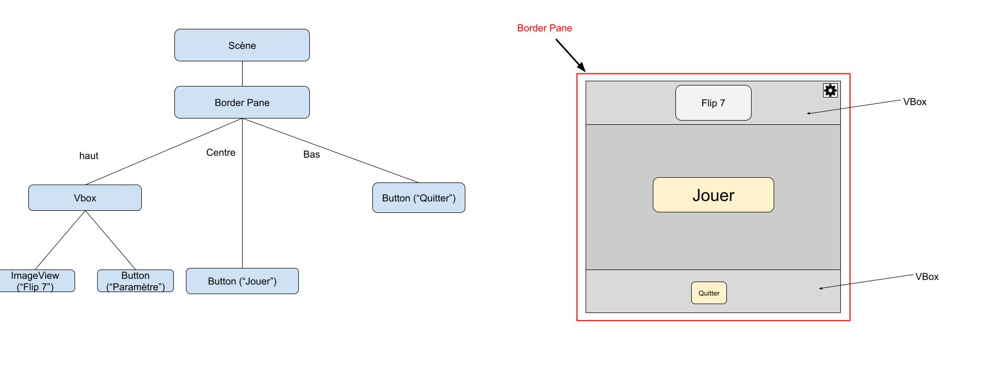
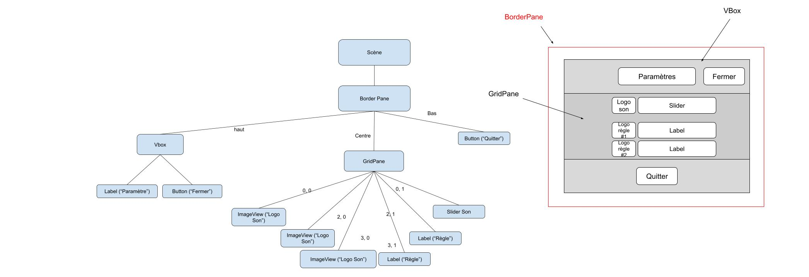
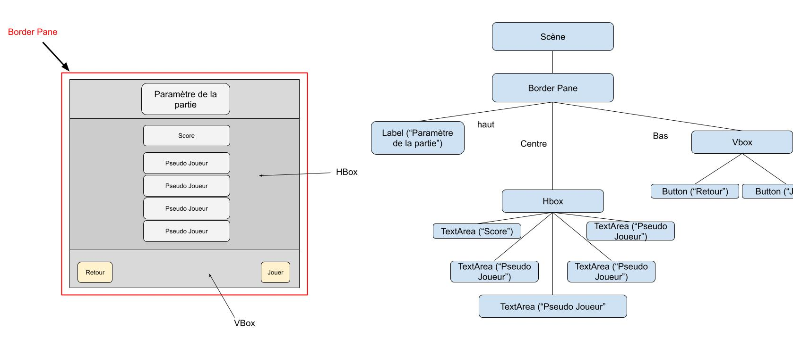
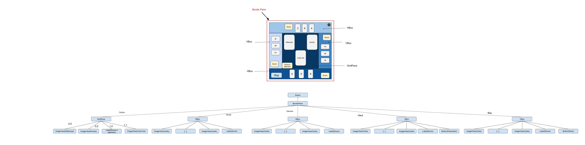

# Maquette JAVA FX Flip 7

### Vue Menu principal

La vue est structurée autour d'un BorderPane principal :

**En haut (Top) :** Une VBox centrée qui contient le titre du jeu ("Flip 7") ainsi qu'un bouton situé dans l'angle supérieur droit (représenté par un engrenage) pour accéder directement aux parametre.

**Au centre (Center) :** Un grand bouton de lancement central "Jouer", Pour démarer la partie .

**En bas (Bottom) :** Un unique bouton "Quitter" centré, permettant de fermer l'application.

### Vue Menu paramètre

La vue utilise un BorderPane principal pour organiser l'interface de configuration :

**En haut (Top) :** Une VBox contenant un bouton "Fermer" à droite pour valider et revenir à l'écran précédent, sous lequel se trouve un Label indiquant le titre de la vue : "Parametres".

**Au centre (Center) :** Un GridPane, contenant le réglage du son avec un logo et un slider à côté. Et les règles du jeu avec un logo et un label à côté.

**En bas (Bottom) :** Un bouton "Quitter" aligné au centre pour fermer directement l'application, ou pour mettre fin a la partie en cours.

### Vue initialisation de la partie

La vue utilise un BorderPane principal :

**En haut (Top) :** Un label centré "Paramètre de la partie".

**Au centre (Center) :** L'interface utilise une HBox Contenant plusieurs éléments de saisie (TextArea) : un premier champ pour définir le "Score" (le score final a atteindre), suivi de quatre champs de saisie "Pseudo Joueur" permettant d'entrer les noms des participants (si seulement 1 seul joueur est indiquer alors une Alerte box apparaît pour montrer l'erreur, les champs vide ne seront pas compter comme des joueurs).

**En bas (Bottom) :** Une VBox gérant les deux boutons aux extrémités : un bouton "Retour" aligné à gauche pour annuler et revenir au menu principale, et un bouton "Jouer" aligné à droite pour lancer la partie.

### Vue Partie en cours

La vue est un Border Pane Principale :

**Au centre (Center) :** l'interface  un Grid Pane qui contient la pioche, la défausse et la carte que le joueur vient de tirer. Sur les côtés et en haut, on a le jeu des autres joueurs avec leur main et leur score. En bas, on a le joueur actuel qui joue, le bouton pour s'arrêter ("Stop"), son score et ses cartes.

En haut et en bas il s'agit d'une Hbox et sur les côtés il s'agit d'une Vbox Dedans on y retrouve les cartes et le score de chaque joueur. Le joueur dont c'est le tour est en bas avec un boutton stop supplémentaire si il veut s'arrêter de jouer de plus en haut a droite il y a le boutton "paramèttre"

Chaque joueur a une couleur différente de fond pour bien les différencier.

### Vue Menu de fin de partie

La vue utilise un BorderPane principal :

**En haut (Top) :** Un label affichant le "score" de chacun des joueurs .

**Au centre (Center) :** le central est  dédié à l'affichage des scores de chacun des joueurs et du vainqueurs.

**En bas (Bottom) :** Une VBox regroupe trois boutons d'action : "Menu" (pour retourner à l'écran d'accueil), "Relancer" (pour recommencer une partie avec les mêmes joueurs) et "Quitter" (pour fermer l'application).
