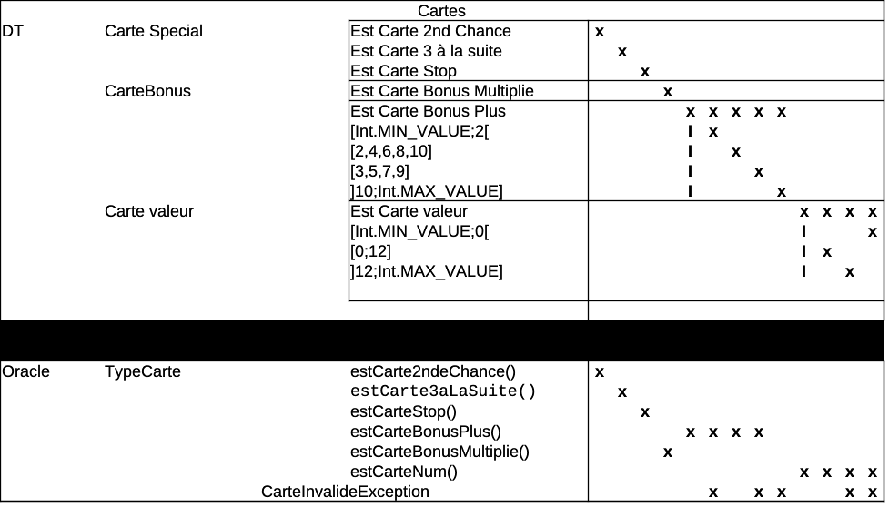
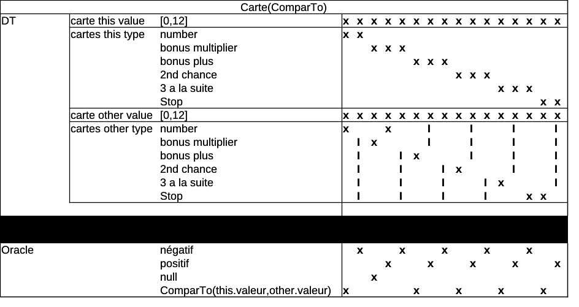
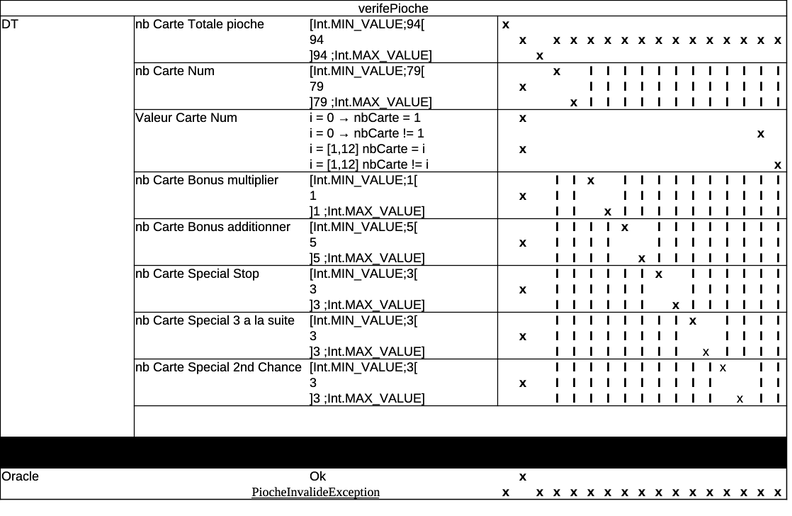
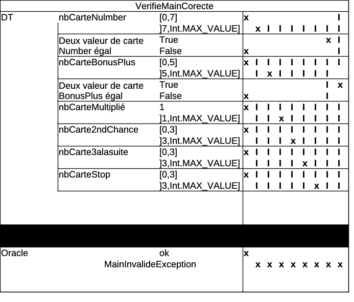
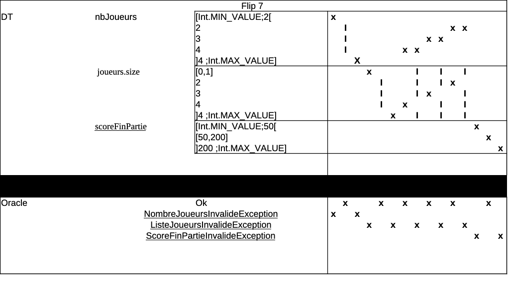

## Rapport de test ##
### 1. La verification des cartes et de leurs types ###

Nous verifions si les methodes pour vérifier les cartes et leurs types fonctionnent correctement 
les cartes bonus et spécial et les différentes valeurs (2, 3, 4, 5, 6, 7, 8, 9, 10, 11, 12). 
Nous avons vérifié que les méthodes reconnaissent correctement les cartes et leurs types.

#### La Table de descision pour les cartes  ####

Les differents Tests sont réalisé pour chaque carte dans les classes : 
- Carte2ndeChanceTest (CT1,CT2)
- Carte3aLaSuiteTest (CT1,CT2)
- CarteBonusPlusTest (CT1:CT6)
- CarteSMultiplicationTest(CT1:CT2)
- CarteNumTest (CT1:CT6)
- carteStopTest (CT1,CT2)

#### vérification de la méthode toString() ####
Nous verifion également pour chaque carte que ça méthode toString() fonctionne correctement et renvoie le bin text pour chaque carte.
- Carte2ndeChanceTest (CT6)
- Carte3aLaSuiteTest (CT8)
- CarteBonusPlusTest (CT13,CT14)
- CarteSMultiplicationTest (CT18)
- CarteNumTest (CT12)
- carteStopTest (CT6)

### 2. La verification du compareTO ### 
Nous avons vérifié que la méthode compareTo fonctionne correctement pour comparer les cartes entre elles.

#### La Table de descision pour le compareTo   ####

Les differents Tests sont réalisé pour chaque carte dans les classes :
- Carte2ndeChanceTest (CT3:CT5)
- Carte3aLaSuiteTest (CT3:CT7)
- CarteBonusTest (CT7:CT14)
- CarteSMultiplicationTest (CT3:CT7)
- CarteNumTest (CT7:CT12)
- carteStopTest (CT3:CT5)

### 3. La verification de la pioche ###
Nous avons vérifié que la pioche est correctement initialisée avec les bonnes cartes.

#### La Table de descision pour la picohe   ####

TODO

### 4. La verification de la main d'un joueur ###
Nous avons vérifié que la main d'un joueur est correctement tout au long de la partie .

#### La Table de descision pour la main d'un joueur   ####

### 5. La verification de la classe Flip7 (initialisation) ###

Nous avons vérifié que la classe Flip7 est correctement initialisée avec les bonnes valeurs pour les joueurs, et le score final.

#### La Table de descision pour la classe Flip7 (initialisation)   ####

Cette verification est réalisé dans la classe Flip7Test

# Test Flip7 - Scénario de jeu

Ces scénarios ont étaient codés dans le fichier `Flip7Test.kt`, ils représentent toutes les cas de jeu classique d'une partie de Flip7. Tout ces tests ont réalisé avec un jeu de 2 joueurs pour des soucis d’efficacité mais le comportement est le même avec 3 ou 4 joueurs.

* *CT10_testPiocheSupprimeCarte :* Ce test vérifie que la taille de la pioche à bien était diminuer de 1 après que le `joueur courant` est pioché une carte.

* *CT13_testJoueurDitStop :* Ce test vérifie qu'après que le joueur courant est dit stop, son était à bien était changé en état joueur **Stop**.
*  *CT11_joueurCourantCibleStop :* Ce test vérifie que après que le joueur courant est pioché une `carte Stop` et qu'il cible un autre joueur, cet autre joueur est bien en état joueur **Stop**.
*  *CT14_testJoueurPerd :* Ce test vérifie qu'après qu'un joueur est pioché une `carte numéro` et la même à son prochain tour, son état soit bien passé en état joueur **Perdu**.
*  *CT12_test3aLaSuiteFaitPerdre:* Ce test vérifie qu'après qu'un joueur est pioché la `carte 3 à la suite` et que dans les prochaines cartes il y ait un doublon de numéro l'état du joueur ciblé est bien en état joueur **Perdu**.
* *CT13_testJoueurDitStop :* Ce test vérifie qu'après que le joueur courant est dit stop, son était à bien était changé en état joueur **Stop**.
*  *CT14_testJoueurPerd :* Ce test vérifie qu'après qu'un joueur est pioché une `carte numéro` et la même à son prochain tour, son état soit bien passé en état joueur **Perdu**.
* *CT15_testJoueurJoueEncore :* Ce test vérifie que si le joueur a une seconde chance dans sa main,  et qu'ensuite il se retrouve à pioché un doublon de numéro, son état ne soit pas en perdu mais en état joueur **Joue_Encore**
* *CT17_scoreMancheJoueurMarque0 :* Ce test vérifie que si les deux joueurs qui jouent disent stop l'un après l'autre, le score de la manche est 0.
* *CT18_scoreMancheJoueurMarque5 :* Ce test vérifie qu'après que le premier joueur est pioché une carte 5 puis qu'il dit stop et que le deuxième joueur dit stop aussi, le score du premier joueur est de 5.
* *CT19_scoreMancheJoueurPerduMarque5 :* Ce test vérifie que si le premier joueur pioche un doublon de 5 qu'il perd et que l'autre dit stop, le score du premier joueur est de 5.
* *CT20_testEtatPartie :* Ce test vérifie qu'après chaque étape du jeu, l'état partie change bien et soit le bon, on commence avec l'état partie **Attente_Choix_Joueur**, puis il pioche une `carte Stop` donc l'état de la partie passe en état partie **Attente_Cible_Stop**, une fois qu'il a ciblé le deuxième joueur, on repasse en état partie **Attente_Choix_Joueur**, le premier joueur pioche une `carte 3 à la suite`, on passe donc en état partie **Attente_Cible_3aLaSuite**, une fois qu'il a ciblé lui même sachant que la pioche contenait un doublon de numéro après cela, l'état de la partie passe en état partie **Manche_Terminee**, puis une fois qu'on calcule le score de la manche, on passe en état partie **Nouvelle_Manche**.
* *CT21_testEtatPartieTerminee :* Ce test vérifie que pour un score final de 50, et que le premier joueur pioche à la suite (12,11,10,9,8) = 50 et qu'il dit stop, une fois le score de la manche calculé, l'état de la partie passe en état partie **Partie_Terminee**.
* *CT22_scoreMancheScoreCumuleApresDeuxManches :* Ce test vérifie que après avoir joué deux manche consécutives les score de la deuxième manche a bien augmenter par rapport au score de la première manche.
* *CT23_scoreManchePrendEnCompteBonusPlus et CT24_scoreManchePrendEnCompteBonusMultiplie :* Ces tests vérifient que les cartes spéciale qui ajouent comme `bonus plus` ou `bonus multiplie` soient bien pris en compte dans le calcul du score de la manche.

Nous avons donc effectué une longue série de tests sur le jeu FLIP7. Il y a plusieurs points positifs et négatifs sur la testabilité :

* **Positif :**
 * L'attribut debug qui permet de controler le comportement de la pioche 
 * L'utilisation des exceptions qui permet de tester facilement les débordements etc...

* **Negatif :**
 * La création de la pioche avec les differentes cartes (numéros,spéciales,bonus)
 * La création de pioche spécifique pour tester des configurations

La création de la pioche et de la liste des joueurs à donc était plus facilement testé avec la librairie mockk.
